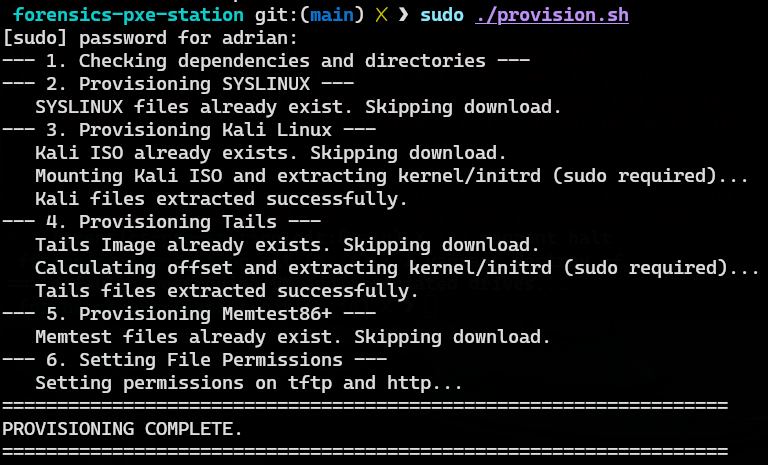
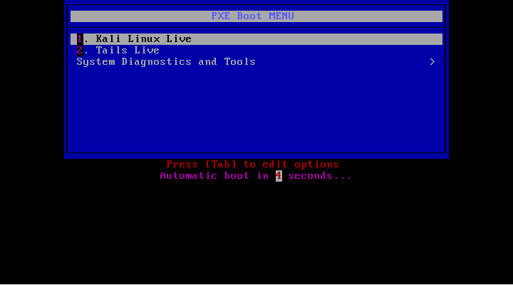

# Deployment, Verification, and Conclusion

## 6.1. Deployment and Startup Sequence

**File Provisioning:** The necessary kernel (vmlinuz), initial RAM disk (initrd.img), and large OS images (.iso, .img) must be downloaded and correctly placed in the ./tftp and ./http directories respectively. Kernel files are extracted from the main OS images.

```bash
chmod +x provision.sh
sudo ./provision.sh
```



After provision, your directory tree must look like this:

```
 forensics-pxe-station git:(main) ❯ tree
.
├── config
│   └── dnsmasq
│       ├── default
│       │   └── dnsmasq
│       └── dnsmasq.conf
├── docker-compose.yml
├── Dockerfile
├── docs
│   └── ...
├── http
│   ├── kali-linux-2025.3-live-amd64.iso
│   └── tails-amd64-7.2.img
├── LICENSE
├── provision.sh
├── README.md
├── tftp
│   ├── chain.c32
│   ├── kali
│   │   ├── initrd.img
│   │   └── vmlinuz
│   ├── ldlinux.c32
│   ├── libcom32.c32
│   ├── libutil.c32
│   ├── memtest
│   │   ├── memtest32.bin
│   │   └── memtest64.bin
│   ├── menu.c32
│   ├── pxelinux.0
│   ├── pxelinux.cfg
│   │   ├── default
│   │   └── tools
│   └── tails
│       ├── initrd.img
│       └── vmlinuz
└── Vagrantfile

13 directories, 41 files
```

**Docker Compose Up:** The two container services are launched.

- pxe-dnsmasq starts listening on port 67 (DHCP) and 69 (TFTP).
- http-server starts Nginx listening on port 8080.

```bash
docker-compose up -d --build
```


**Vagrant Up:** The VM is started and configured with its private network interface.

```bash
vagrant up
```


---





## 6.4. Video Demonstration

The following video provides a visual walkthrough of the entire deployment process, from launching the containers to the final successful boot of Kali Linux via PXE:

[](https://youtu.be/QsZuQQd7NHc)